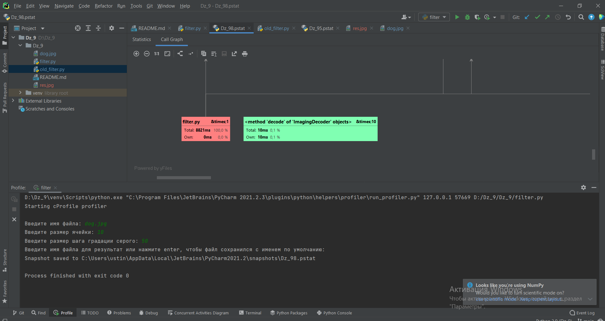
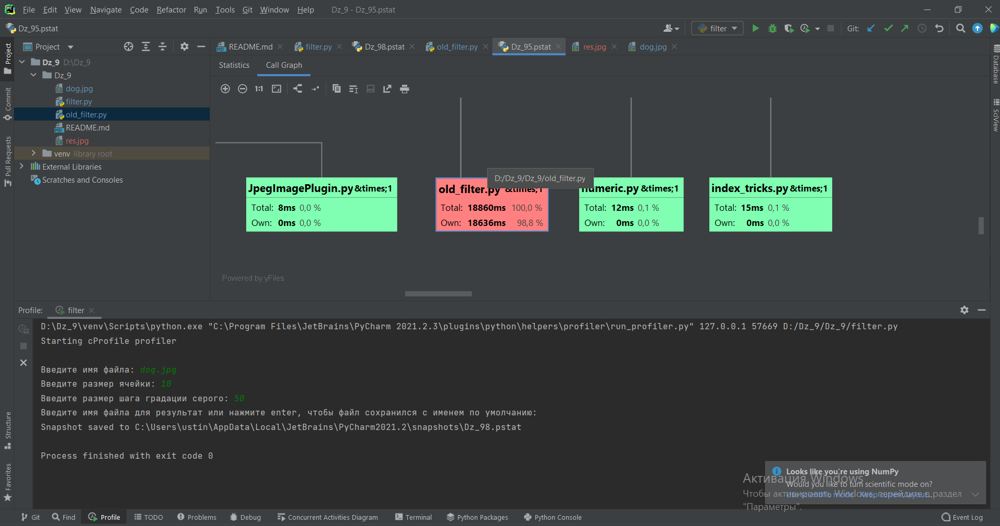
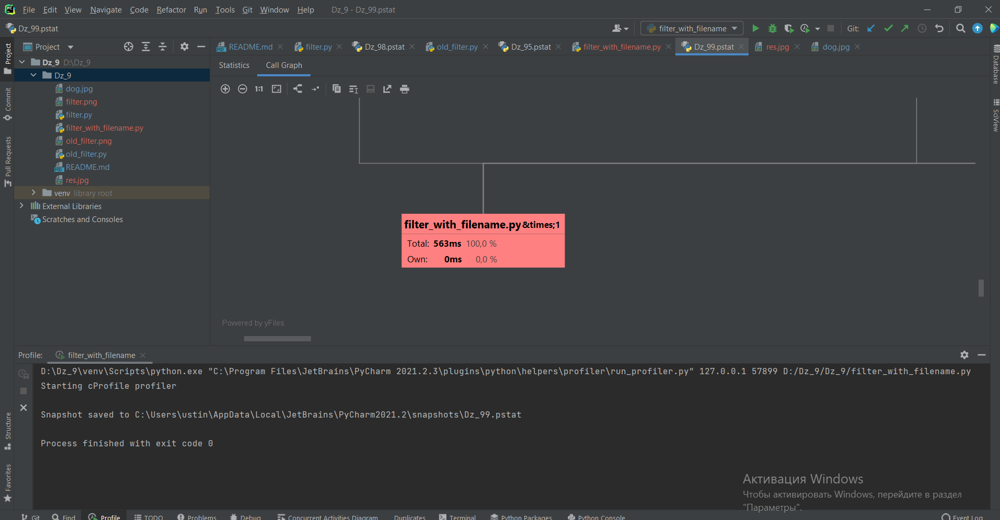
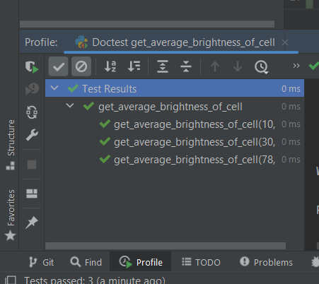

# Dz_9 
Время работы файла filter.py 

 
 
Время работы old_filter.py 

 
 
Разность в временных затратах связанно с тем, что в filter.py используется библиотека numpy, которая обеспечивает 
высокую производительность.

Единственная проблема заключается в том, что в filter.py затрачивается много времени на ввод данных с клавиатуры.  
Для этого я сделал новый файл filter_with_filename.py в котором значения задаются в коде. 
 
filter_with_filename.py 

 

Вследствие этого мы получили более точную информацию о производительности.

# Результаты программ:

Тестовое изображение:

Результат old_filter.py: 

Результат filter.py: 

Результат filter_with_filename.py: 

Результаты тестов: 

